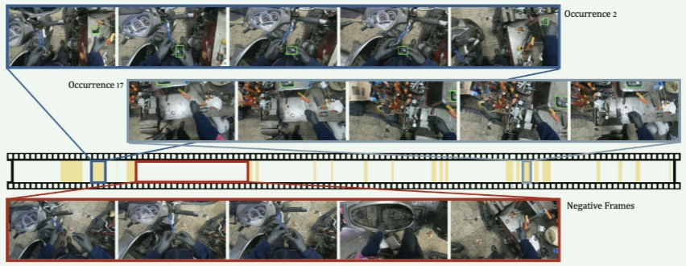
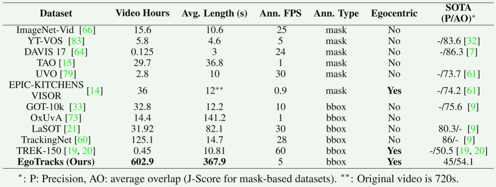

第一人称视角长期跟踪数据集，EgoTracks，源于Ego4D数据集，并提出一个基线算法：EgoSTARK。

# EgoTracks：一个长期的以自我为中心的目标跟踪数据集
## 摘要
视觉目标跟踪是许多自我中心视觉问题的关键。然而，具身智能所面临的以自我为中心的跟踪挑战在许多现有的数据集中都没有得到充分的体现，这些数据集往往集中在简短的第三人称视频上。以自我为中心的视频有几个区别于过去数据集中常见的特征：频繁的大型摄像机运动和手部与物体的交互通常会导致遮挡或目标物体离开视野退出到视频帧外，并且由于视角、尺度或物体状态的广泛不同，物体外观可能会迅速变化。跟踪本身这个问题也应该是长期的，并且能够在生命周期内一致地（重新）将对象与它们的出现和消失相关联是至关重要的。以前的数据集强调这种重新检测问题，它们的“框架”性质导致了各种时空先验的采用，我们发现这些先验不一定适用于以自我为中心的视频。因此，EgoTracks，一个新的数据集，用于长期以自我为中心的视觉对象跟踪。来自Ego4D数据集，EgoTracks对最近最先进的单目标跟踪提出了重大挑战，根据传统的跟踪指标，我们发现新数据集的得分比现有的流行基准更差。我们进一步展示了可以对STARK跟踪器进行的改进，以显着提高其在以自我为中心的数据上的性能，从而产生了我们称为EgoSTARK的基线模型。

## 介绍
第一人称或“自我中心”视觉旨在捕捉智能体所面临的现实世界中的感知问题;它作为高度相关的视觉领域，最近引起了强烈的兴趣，其重要应用范围从机器人到增强和混合现实等。视觉目标跟踪（VOT），长期以来一直是视觉中的一个基本问题，是许多以自我为中心的任务的核心组成部分，包括跟踪动作或活动的进展，建立包围目标对象的（重新）关联，以及预测环境的未来状态。然而，尽管VOT领域在过去十年中取得了许多重大进展，但以自我为中心的视频中的跟踪仍然未得到充分探索。这种缺乏关注在很大程度上是由于缺乏大规模的以自我为中心的跟踪数据集进行训练和评估。虽然社区近年来提出了许多流行的跟踪数据集，包括OTB，TrackingNet，GOT-10k和LaSOT等，但我们发现最先进的跟踪器在这些基准上实现的强大性能并不能很好地转化为以自我为中心的视频，因此建立了对这种跟踪数据集的强烈需求。

我们将这种问题归因于自我中心视图的许多独特属性上，与以前第三人称视角的数据集相比。与人为有意之的“framed”视频相反，以自我为中心的视频通常是未经规划和处理的，这意味着它们往往会捕捉到活动、对象或地点之间的许多注意力转移。由于第一人称视角，相机佩戴者的大幅度头部运动通常会导致物体反复离开和重新进入视野;类似地，对物体的人为手部操作会导致频繁的遮挡，尺度和姿势的快速变化以及状态或外观的潜在变化。此外，以自我为中心的视频往往很长（有时代表相机佩戴者或独立个体的整个生活），这意味着上述遮挡和变换的数量相似。这些特征都使得在以自我为中心的视图中跟踪对象比在先前数据集中通常考虑的场景更加困难，并且它们的缺失代表了评估盲点。

头部运动，移动，手部遮挡，和短暂的时序长度都导致多种挑战。首先，频繁的对象消失和再现导致自我中心跟踪内的重新检测的问题变得特别关键。许多以前的跟踪数据集主要集中在第三人称视频中的短期跟踪，由于目标对象消失的数量和长度较低，因此评估长期自我中心跟踪的许多挑战的能力有限。因此，强大的性能依赖于鲁棒的重新检测，导致许多近几年内的短期跟踪算法都忽略它，而是预测每帧的边界框，这可能导致误报或跟踪错误的对象。此外，短期第三人称视频的特性也导致了依赖于运动和外观的渐变的设计。以前的短期跟踪算法所做的许多运动，上下文和规模先验无法转移到以自我为中心的视频。 很明显，重新检测，遮挡和长时间跟踪均在VOT中被认为是难以完善和处理的，这也是这几年跟踪强调的几个方面。我们认为，以自我为中心的视频为这些挑战提供了一个自然的来源，同时也代表了一个高度影响力的跟踪应用方向，因此这些都是一个个的重要的机遇。因此，我们提出了EgoTracks：一个大规模的长期以自我为中心的视觉对象跟踪数据集，用于训练和评估长期跟踪器。为了寻求现实的挑战，我们从Ego4D中获取视频，这是一个大规模的数据集，由日常生活活动的视频组成。它是一个大规模的数据集，用于评估SOT模型的跟踪和重新检测能力，其中包括来自5708个平均6分钟视频的超过22，028个轨迹。下面这个图是目标对象在视频中频繁出现和消失的体现，如下：
  
  来自EgoTracks数据集的视频，当目标（喷灯）可见时，黄色片段标记。请注意，在8分钟的视频中，物体频繁消失和再现，并且长时间缺席，需要重新检测以准确跟踪而不会出现误报。视频的自我中心性质包括摄像机佩戴者与对象交互（occurrence2），导致显著的手部遮挡和姿势的强烈变化。

我们针对新数据集及其相对于先前基准的新特征进行了彻底的分析，证明了它的难度和进一步研究的必要性，以开发能够处理长期自我中心视觉的跟踪器。我们的实验揭示了剩余的开放性问题和见解，对有前途的方向，以自我为中心的跟踪。利用这些知识，我们提出了多个简单而有效的改变，如调整时空先验，自我中心的数据微调，并结合多种模板。我们将这些策略应用于最先进的（SOTA）STARK跟踪器，训练一个致力于长期自我中心跟踪的强大跟踪器：EgoSTARK。我们希望EgoSTARK可以作为一个强大的基线，并促进未来的研究。

我们的贡献如下：
  - 我们提出了EgoTracks，第一个大规模的长期对象跟踪数据集与不同的自我中心的情况。我们分析了它的独特性，在评估跟踪器的重检测性能。
  - 我们进行了全面的实验，以了解许多最先进的跟踪器在EgoTracks验证集上的性能，并观察到由于现有第三人称数据集的偏见和评估盲点，它们往往会挣扎。
  - 我们进行了分析，是什么因素可以使一个很好的跟踪面向长时性质的自我中心的tracker。将这些学习应用于STARK跟踪器，我们产生了一个强大的基线，我们称之为EgoSTARK，它在EgoTracks上实现了显着的改进（+15% F-score）。

## 相关工作
### 目标跟踪数据集
视觉目标跟踪研究视频中目标的时空联合定位。从视频和预定义的分类，多目标跟踪（MOT）模型同时检测，识别和跟踪多个对象。例如，MOT数据集跟踪人类，KITTI数据集跟踪行人和汽车，TAO跟踪833个类别的大型分类。相比之下，单目标跟踪（SOT）经由所提供的对象的初始模板跟踪单个对象，而不进行任何检测或识别。因此，SOT通常是无分类法的，并对通用意义上的目标对象进行操作。当前的社区已经构建了多个流行的基准来研究这个问题，包括OTB-50/100，UAV-123，NfS，TC-128，NUS-PRO，GOT-10k，VOT-series、LaSOT和TrackingNet等。虽然这些SOT数据集主要由短视频（例如几秒钟）组成，但长期跟踪越来越受到关注。在较长的视频（几分钟或更长时间）中跟踪对象会带来独特的挑战，例如显著的变换、位移、消失和再现。除了在可见时定位对象之外，模型还必须在对象不存在时不产生框，然后在对象重新出现时重新定位同一对象。OxUvA是最早对较长视频（平均2分钟）进行基准测试的视频之一，拥有366个仅限评估的视频。LaSOT 将其扩展到1400个视频，具有更频繁的对象再现。同时，VOT-LT则包括50个故意选择的视频中频繁的目标物体消失和再现。我们的EgoTracks专注于长期的SOT，并呈现出多个关键和独特的属性：
  - 1）显著更大的规模，平均6分钟的5708个视频; 
  - 2）更频繁的消失和再现（平均17.7次）发生在自然，真实世界的场景; 
  - 3）数据来源于自我中心的视频拍摄在野外，涉及独特的挑战性的情况下，如大相机运动，不同的角度变化，手物体的相互作用，和频繁的闭塞。
### 单目标跟踪算法
许多现代方法使用卷积神经网络（CNN），无论是Siamese网络还是基于相关滤波器的架构。随着最近在分类和检测等视觉任务中大获成功的基于Transformer架构的跟踪算法也变得流行起来。例如，TransT使用基于注意力的特征融合来关联模板特征和搜索图像的特征。最近，一些工作利用Transformer作为直接预测器来实现新的SOTA，例如STARK，ToMP和SBT。这些模型将来自ResNet编码器的帧特征token化，并使用Transformer来预测边界框和具有特征标记的目标存在得分。这些方法通常是在短期SOT数据集上开发的，并假设目标对象以最小的遮挡保持在视场中。另一方面，长期跟踪器被设计用于实现在目标再现时重新检测到的问题。这些方法旨在了解潜在的目标对象消失，搜索整个图像以寻找其再现的区域。

### 第一视角中的目标跟踪
过去几十年中引入了多个以自我为中心的视频数据集，带来了许多有趣的挑战，其中许多需要跨帧关联目标对象：活动识别，预期，视频摘要、人与物体交互、情景记忆、视觉查询和相机佩戴者姿势推断。 为了应对这些挑战，许多方法都利用了跟踪，但很少有工作专门致力于解决这个基本问题。  但是有很多工作已经开始认识到自我为中心的挑战，并且可能是与我们最相关的工作。 然而，主要区别在于数据集的规模：[19, 20] 包含 150 个仅用于评估的轨道，而 EgoTracks 则大 100 倍（参见表 1），包含 20k 个带有训练和评估分割的轨道。 此外，虽然过去的工作是从以厨房为主的 EPICKITCHEN [12] 中获取视频，但 EgoTracks 从 Ego4D [29] 中获取视频，后者具有更多样化的场景。  EgoTracks 提供了一个独特的大规模测试平台，用于开发专用于以自我为中心的视频的跟踪方法； 我们改进的基线 EgoSTARK 还可以作为潜在的即插即用模块来解决需要对象关联的其他任务。

  VOT数据集比较。EgoTracks除了比以前的数据集规模更大之外，其捕获的场景对 SOTA 跟踪器来说是一个更加艰巨的挑战，这表明跟踪方法还有改进的空间。
