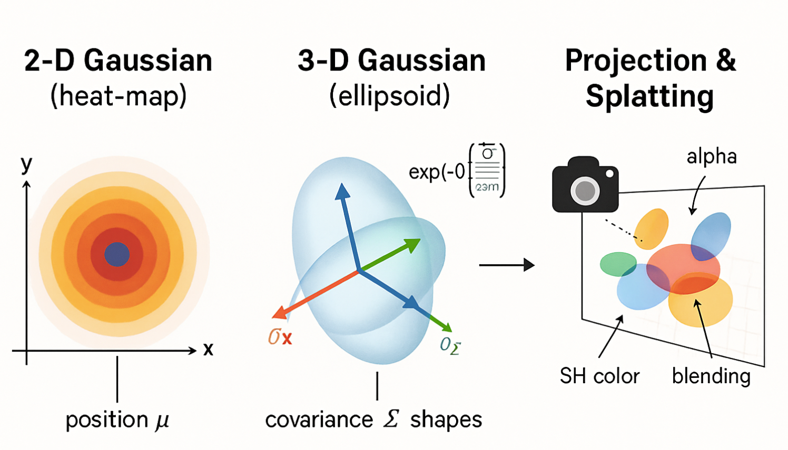

# $\dagger$ 一个教程全部读懂3D高斯
##### $\textbf{【注意】}\textcolor{red}{本教程由曹逸飞撰写，转载需引用}$
## $\dagger$ 3D Gaussian Splating介绍 【打基础】

如下是几个我们必须要看完之后能够回答的问题：
- 为什么3D高斯是一个椭球？
- 为什么协方差矩阵可以控制椭球形状呢？
- 为什么协方差矩阵能用旋转和缩放矩阵表达呢？
- 各向异性和各相同性是什么意思？
- 为什么引入雅各比？
- 球协函数怎么能更好的表达颜色？
- 3d GS怎么就快了呢？

同时，我们在开始教程之前，先默认您对坐标变换（世界坐标系、相机坐标系以及像素和图像坐标系之间的变换是了解和熟悉的，如果非也，请先补充这方面的内容。建议搜索GAMES101闫令琪老师的计算机图形学CG教程）

## 一句话解释3D高斯泼溅：使用3D gaussian球表示三维模型，并通过splating技术渲染出来

- $\dagger$ 原始论文介绍
```《3D Gaussian Splatting for Real-Time Radiance Field Rendering》这篇论文由 Bernhard Kerbl, Georgios Kopanas, Thomas Leimkühler, 和 George Drettakis 等人在2023年发表，并在计算机图形学领域引起了广泛关注，因为它在保持高质量渲染的同时，实现了新视角合成的实时性能。基于这篇论文开启3D高斯的时代。如下是对3D高斯泼溅的流程示意图，分为如下几个核心步骤：1）输入照片 → SfM 得到稀疏点云；2）点云包裹成初始 3D 高斯椭球；3）优化阶段：高斯被拉伸、移动、改颜色；4）自适应：有需要的地方高斯分裂 / 克隆；无用的被剪枝；5）瓦片光栅化：高斯投影成 2D 椭圆并分 tile 进行前后混合；6）实时渲染：得到最终可交互视图```


### 1.1 摘要 (Abstract)
论文的摘要指出，先前的新视角合成方法要么渲染质量高但速度慢（如NeRF及其许多变体），要么渲染速度快但质量有所牺牲。这篇论文提出了一种新的方法，通过使用3D高斯函数来表示场景，实现了高质量的渲染和实时的显示速度。

首先看核心思想（对于小白新手不理解，但别急，后面会解释每一个词儿的含义）：
1.  使用3D高斯来存储场景的几何和外观信息，每个高斯都有其位置、形状（通过各向异性协方差矩阵表示）、不透明度（alpha值）和颜色（通过球谐函数表示，以支持视角相关的效果）。
2.  从运动恢复结构（SfM）得到的稀疏点云开始初始化这些3D高斯。
3.  在优化过程中，交替进行高斯参数的优化和自适应的密度控制（即增加或删除高斯）。
4.  开发了一个快速的、可微分的基于瓦片（tile-based）的光栅化器，能够高效地将3D高斯“泼溅”（splatting）到图像平面上。

【通俗解释】我们现在开始通俗解释一下这几个含义：我们用大白话把这四个核心思想拆解开，讲讲每个专业名词是啥意思，它们具体是干嘛的。想象一下，我们要用电脑造一个跟真实世界一模一样的3D场景，比如一个房间。

---

**核心思想 1：使用3D高斯来存储场景的几何和外观信息，每个高斯都有其位置、形状（通过各向异性协方差矩阵表示）、不透明度（alpha值）和颜色（通过球谐函数表示，以支持视角相关的效果）。**

*   **大白话解释：**
    我们不用传统的积木块（比如三角形、正方形）来搭建这个3D房间，而是用很多很多微小的、彩色的、有特定形状的“3D小云彩”或者“3D小墨点”来把它堆出来。每一个“小云彩”都有它自己的特点。

*   **专业名词和具体内容：**
    1.  **3D高斯 (3D Gaussian)：**
        *   **含义：** 这就是我们说的“3D小云彩”或“3D小墨点”。它不是一个硬邦邦的点，而是一个在空间中弥散开的、有中心、有范围的分布。数学上，它是一个高斯函数在三维空间的表示。
        *   **公式概念：** 一个基础的高斯函数（未归一化的，因为我们更关心它的形状和影响范围），在认识之前先看看高斯函数的样子：
        
        
        
        
        
        
        
        
        
            这里我们需要知道的一点就是正常的椭圆公式我们知道个形式，那么为啥高斯这个也表示椭圆的形式呢？这个可以从下面的分析中理解：
        
        二维的形式那个不就是椭圆的形式吗？那么我们现在再看：
        
        可以看到3D高斯是一个实心椭球而不是椭圆壳

        我们接下来给出几种变换后的推导过程，从而能够直观的看到最终的表达形式：

        
        
        
        

        把变换矩阵A转换为协方差矩阵（表述随机变量两两之间的联合变动情况）：

        
        
        而高斯函数知道之后，我们再看高斯泼溅，这是一种光栅化技术，也就是计算机图形学中类似的三角形光栅化，这种用来在屏幕上绘制三角形，而现在是用高斯分布代替三角形呈现，如下对比：

        
        

        要想更好的理解3D到2D层面，这个CG过程如下：首先是任意立方体（具有左右上下前后），我们将其放置于坐标系原点那里，这个过程就是正交投影：
        
        
        
        而透视投影具有远小近大的特性，即和z有关，因此：
        
        
        
        然后就是视口变换（因为实际上物体具有缩放比，拉伸的时候会拉伸为正方体，因此具有缩放比，拉到像素平面上）：
        
        
        
        ，这样在光栅化的时候就有了：
        
        

        现在我们看到3D高斯的观测变换：
        
        
        
        

        

        

        因此可以看到高斯的这种有这么几种参数：position点的位置（xyz，3D高斯中心值则是$μ$，、用均值表示）、颜色（RGB）、covariance mareix协方差（如何拉伸和缩放，3x3矩阵，决定高斯的形状）、opacity透明度（alpha透明度用于splating）、spherical harmonics球谐函数拟合视角相关的外观，下面可以看到高斯渲染和不透明的样子（有类似高斯椭球的样子）：

        
        

    2.  **3D高斯的位置 (Position, μ)：**
        *   **含义：** 就是这个“3D小云彩”的中心点在3D空间里的坐标 (x, y, z)。
        *   **公式体现：** $μ$

    3.  **3D高斯的形状（通过各向异性协方差矩阵表示, Shape represented by anisotropic covariance matrix）：**
        *   **含义：**
            *   **协方差矩阵 (Covariance Matrix, Σ)：** 这是一个3x3的数学矩阵，它精确地描述了这个“3D小云彩”的形状和朝向。它可以告诉我们这个“小云彩”在三个主方向上分别有多“胖”或多“瘦”，以及它在空间中是如何旋转的。看协方差矩阵是如何控制椭球形状的？如下分别是一个高斯分布和标准的高斯分布，
            和
            
            而这个结论：任意高斯都可以由标准高斯经过放射变换得到，该如何理解，不妨这么想————二维空间里面的一个正方形放射变化会变成平行四边形，三维空间里面的球放射变换就是椭球，二维空间里面的圆放射变换后就是椭圆。所以才说，协方差矩阵控制椭球的形状，是这么来的。那么另一个问题：协方差矩阵怎么也就能用旋转和缩放矩阵表达呢？自然而然————
            这样子下面的公式也就懂了吧~~协方差则可以通过奇异值分解求得R和S。
            *   **各向异性 (Anisotropic)：** 意思就是“小云彩”在不同方向上可以有不同的“胖瘦”。比如，它可以像一个鸡蛋（一个方向长，另两个方向短），而不是一个完美的球（各个方向一样，这种叫做各向同性，协方差如果把对角线元素保留下来，其他都是0的话这种就是各向同性的性质）。这对于表达扁平的表面（比如墙面、桌面）或者细长的物体（比如柱子）非常重要。
        *   **公式体现：** $Σ$。为了方便优化，论文中通常不直接优化$Σ$的9个元素，而是优化一个缩放向量 $s$ (scale) 和一个旋转四元数 $q$ (rotation)。然后通过它们计算出$Σ$：$Σ = R S Sᵀ Rᵀ$，其中 $R$ 是从 $q$ 得到的旋转矩阵，$S$ 是由 $s$ 构成的对角缩放矩阵。这样能更好地控制形状。

    3.  **不透明度 (Opacity, α / alpha value)：**
        *   **含义：** 就是这个“小云彩”有多“实”。一个完全不透明的“小云彩”会完全挡住它后面的东西；一个半透明的“小云彩”则会透出一些后面的颜色。取值通常在0（完全透明）到1（完全不透明）之间。
        *   **公式体现：** $α$

    4.  **颜色（通过球谐函数表示，以支持视角相关的效果, Color represented by Spherical Harmonics for view-dependent effects）：**
        *   **含义：**
            *   **颜色 (Color)：** $C$表示，就是这个“小云彩”是什么颜色的。
            *   **球谐函数 (Spherical Harmonics, SH)：** 这是一种数学工具，可以用来描述一个东西从不同方向看过去颜色是怎么变化的。想象一个有光泽的金属球，你从正面看和从侧面看，它反射的光和颜色可能会不一样。球谐函数就能捕捉这种“视角相关的效果”。用它来表示颜色，可以让渲染出来的物体表面有更真实的光泽感和材质感。如下是球协函数的可视化，具体数学的推导不做说明，我们尽可能白话直观的进行解释和理解：
            
            下面是其数学的一个方程表示，感兴趣的可以参照下面的教程进行理解：[点击这里](https://zhuanlan.zhihu.com/p/430163791)
            

            
            - 【通俗白话的解释一下SH函数】归根到底它是一组基函数，至于这组基函数是怎么来的，不管它。我们都学过泰勒展开和傅里叶变换等，那么，这个基函数就不陌生了，比如下面的多项式$y_0=x^0$,$y_1=x$,$y_2=x^2$,$y_3=x^3$...。再比如三角函数$y_0=1$,$y_1=sin(x)$,$y_2=sin(2x)$,$y_3=sin(4x)$...，或者也可以随便去写自己的基函数，$y_0=555$,$y_1=x^3-666$...,这些基函数有了的话，我们可以用这些基函数组合加权去表示任何的函数，一般情况下，能用的基函数越多表达的能力也就越强，本质上看这就是一个有损的压缩，有点儿像是一个密码本，你一本我一本，上面都是基函数的定义，这样传密码本的时候只要传几个系数就可以了，系数传过来，就能复原出想要表达的函数，只是需要优化和精准而已。下面这个图像就特别明显的说明了一个黑色方波函数的信号通过一堆基函数的加权描述会越来越接近这个函数的样子：
            
            因此，这是二维的，三维中的球面坐标系上也这样，不用距离而用颜色表示的话就是不同的明暗程度的变化。而最最最有名的球面基函数就是这个球协函数了，球协函数的性质有很多，比如正交性，旋转不变性，正交性能够说明每一个基函数都是独立的，每一个基函数都不能用别的基函数加权得到，球协函数就长这样，其中蓝色的表示正数，而黄色表示负数，如下图所示：
            
            表达式的化长这样子：
            
            相信你看到这个应该和他一样的表情：
            
            那么我们如果把它退化到二维，就变成了下面这样，这个是示意图：
            
            现在看假如极坐标下的函数长这样，，可以表示为$r=0.5+0.1cos\theta+0.25sin\theta+0.09cos\theta sin\theta+0.3（2cos\theta^2-1）$,只记函数的话，这个数字就是SH系数啦，当SH系数用的越多，那么表达能力也就越强，跟原始的函数就越来越接近。
            
            当用来描述不同方向的光照的SH基函数我们一般用到二阶或者三阶。我们可以看下面的代码配套的讲解，看是否更好的理解，对于具体的公式推导不需要那么深，知道系数和计算表达式怎么写的即可：
            

            更完整的表达和理解参照：[这里](https://zhuanlan.zhihu.com/p/351289217)。


        *   **公式体现：** 颜色通常用一组球谐系数来表示，例如 $c_{sh} = \{sh_0, sh_1, ..., sh_k\}$。当给定一个观察方向 $d$ 时，最终的颜色 $C = EvaluateSH(c_{sh}, d)$。

        

        

        

---

**核心思想 2：从运动恢复结构（SfM）得到的稀疏点云开始初始化这些3D高斯。**

*   **大白话解释：**
    在开始用“小云彩”搭建房间之前，我们不是瞎摆，而是先用一种技术（SfM）处理一堆房间的照片，得到一些房间里关键特征点的3D位置。这些点可能不多，比较稀疏，就像一个大致的骨架。然后，我们就在这些骨架点的位置上，放置我们最初的“3D小云彩”。

*   **专业名词和具体内容：**
    1.  **运动恢复结构 (Structure from Motion, SfM)：**
        *   **含义：** 这是一种摄影测量技术。你给它一堆从不同角度拍摄的同一个场景的照片，它就能分析这些照片，自动计算出每张照片拍摄时的相机位置和姿态，同时还能估算出场景中一些稳定特征点在三维空间中的位置。
        *   **作用：** 提供初始的3D结构信息。

    2.  **稀疏点云 (Sparse Point Cloud)：**
        *   **含义：** SfM处理后得到的就是一堆三维空间中的点，这些点云通常只包含场景中比较明显的特征，数量相对较少，所以叫“稀疏”点云。它不像最终模型那样细节丰富，但能给出一个大致的轮廓。具体会给出表示放在哪里和朝向哪里的6个自由度也就是6DoF与相对的尺度信息。
        *   **作用：** 作为3D高斯初始化的基础。

    3.  **初始化 (Initialize)：**
        *   **含义：** 就是给我们的“3D小云彩”设定一个最初始的状态。我们会把第一个“小云彩”放在第一个SfM点的位置，它的初始颜色可能就是那个SfM点的颜色，初始形状（协方差）会根据它和周围其他SfM点的距离来大致估算一个大小。
        *   **作用：** 提供一个比随机猜测好得多的起点，让后续的优化过程更快、效果更好。
        如下是用点云创建高斯的初始化过程：
        ~~~python
        def create_from_pcd(self, pcd : BasicPointCloud, spatial_lr_scale : float):
        """
        从稀疏点云(通常来自SfM)初始化3D高斯
        
        参数:
            pcd: 包含点位置和颜色的基础点云
            spatial_lr_scale: 空间坐标的学习率缩放因子，用于处理不同尺度的场景
        """
        # 将numpy数组转换为CUDA张量，并设置为float32精度
        # pcd.points 形状: (N, 3) 其中N是点的数量
        fused_point_cloud = torch.tensor(np.asarray(pcd.points)).float().cuda()
        
        # 将点云中的颜色从RGB空间转换到球谐函数空间
        # RGB2SH 将[0,1]范围的RGB值转换为球谐系数
        fused_color = RGB2SH(torch.tensor(np.asarray(pcd.colors)).float().cuda())
        
        # 初始化球谐特征张量
        # 形状: (N, 3, (max_sh_degree+1)^2)
        # 3是RGB通道数，(max_sh_degree+1)^2是球谐系数总数
        features = torch.zeros((fused_color.shape[0], 3, (self.max_sh_degree + 1) ** 2)).float().cuda()
        
        # 设置0阶球谐系数(DC分量)为转换后的颜色
        # features[:, :3, 0] 选择所有点的所有颜色通道的第0个球谐系数
        features[:, :3, 0 ] = fused_color
        
        # 其余高阶球谐系数初始化为0
        # 这些系数将在训练过程中学习，用于表示视角相关的效果
        features[:, 3:, 1:] = 0.0

        print("Number of points at initialisation : ", fused_point_cloud.shape[0])

        # 计算每个点到其K个最近邻点的平均距离
        # distCUDA2是一个CUDA加速的函数，返回平方距离
        # clamp_min确保最小值为0.0000001，避免后续log运算出错
        dist2 = torch.clamp_min(distCUDA2(torch.from_numpy(np.asarray(pcd.points)).float().cuda()), 0.0000001)
        
        # 初始化缩放参数
        # torch.sqrt(dist2): 将平方距离转换为距离
        # torch.log: 转换到log空间，这是因为优化在log空间进行更稳定
        # [...,None]: 增加一个维度，从(N,)变为(N,1)
        # .repeat(1, 3): 复制到3个轴，初始时各向同性(球形)
        scales = torch.log(torch.sqrt(dist2))[...,None].repeat(1, 3)
        
        # 初始化旋转为单位四元数 (w=1, x=0, y=0, z=0)
        # 这表示没有旋转的状态
        rots = torch.zeros((fused_point_cloud.shape[0], 4), device="cuda")
        rots[:, 0] = 1  # 设置w分量为1

        # 初始化不透明度
        # 0.1是初始不透明度值(相当透明)
        # inverse_sigmoid将其转换到logit空间用于优化
        opacities = inverse_sigmoid(0.1 * torch.ones((fused_point_cloud.shape[0], 1), dtype=torch.float, device="cuda"))

        # 创建可训练参数
        # nn.Parameter告诉PyTorch这些张量需要计算梯度并优化
        self._xyz = nn.Parameter(fused_point_cloud.requires_grad_(True))
        self._features_dc = nn.Parameter(features[:,:,0:1].transpose(1, 2).contiguous().requires_grad_(True))
        self._features_rest = nn.Parameter(features[:,:,1:].transpose(1, 2).contiguous().requires_grad_(True))
        self._scaling = nn.Parameter(scales.requires_grad_(True))
        self._rotation = nn.Parameter(rots.requires_grad_(True))
        self._opacity = nn.Parameter(opacities.requires_grad_(True))
        
        # 初始化屏幕空间最大半径为0
        self.max_radii2D = torch.zeros((self.get_xyz.shape[0]), device="cuda")

        # 保存空间学习率缩放因子
        self.spatial_lr_scale = spatial_lr_scale
        ~~~
---

**核心思想 3：在优化过程中，交替进行高斯参数的优化和自适应的密度控制（即增加或删除高斯）。**

*   **大白话解释：**
    有了初始的“小云彩”后，电脑就开始学习和调整。它会不断地对比用这些“小云彩”画出来的图像和真实照片的差异，然后一点点修改每个“小云彩”的参数（位置、形状、颜色、透明度），让画出来的越来越像真的。同时，它还会智能地判断：如果某个地方细节不够，就多放几个“小云彩”；如果某个“小云彩”没什么用，或者太碍事，就把它删掉。这两件事是轮流进行的。

*   **专业名词和具体内容：**
    1.  **优化过程 (Optimization Process)：**
        *   **含义：** 这是一个学习过程，目标是调整所有3D高斯的参数，使得通过这些高斯渲染出来的图像与输入的真实照片尽可能相似。
        *   **方法：** 通常使用梯度下降算法。计算渲染图像与真实图像之间的差异（损失函数），然后根据这个差异反向计算每个高斯参数应该如何调整才能减小这个差异。

    2.  **交替进行 (Alternating)：**
        *   **含义：** 指的是“优化高斯参数”和“自适应密度控制”这两个步骤不是一次性完成，而是轮流着来。比如，先优化几轮参数，然后做一次密度控制，再继续优化参数，再做密度控制……

    3.  **高斯参数的优化 (Optimization of Gaussian parameters)：**
        *   **含义：** 就是微调每个3D高斯的位置 $μ$、形状（通过缩放 $s$ 和旋转 $q$）、不透明度 $α$ 以及颜色（球谐系数 $c_{sh}$），使得整体渲染效果更好。

    4.  **自适应的密度控制 (Adaptive Density Control)：**
        *   **含义：** 根据场景的复杂度和重建的需要，智能地调整3D高斯的数量和分布。
        *   **增加高斯 (Densification)：**
            *   **克隆 (Cloning)：** 如果一个高斯所在的区域细节不足（表现为优化时这个高斯的位置梯度很大，说明系统想把它“拉扯”开以覆盖更大区域），系统就会复制这个高斯，并把复制出来的新高斯稍微移动一点。
            *   **分裂 (Splitting)：** 如果一个高斯太“胖”了（覆盖了太大的范围，可能导致细节模糊），系统就会把它分裂成两个或多个更小的高斯，以表达更精细的结构。
        *   **删除高斯 (Pruning)：** 如果一个高斯几乎完全透明（$α$ 值非常接近0），说明它对最终图像没什么贡献，就可以删掉它以节省计算资源。或者一些尺寸异常（过大或过小）的高斯也可能被移除。

---

**核心思想 4：开发了一个快速的、可微分的基于瓦片（tile-based）的光栅化器，能够高效地将3D高斯“泼溅”（splatting）到图像平面上。**

*   **大白话解释：**
    为了能很快地把这些3D“小云彩”画到你的2D电脑屏幕上，研究者们专门设计了一个非常高效的“绘画引擎”（光栅化器）。这个引擎有两个特点：
    1.  **快 (Fast) 且 基于瓦片 (Tile-based)：** 它把屏幕分成一小块一小块的“瓦片”（像地砖一样），然后一块一块地画，这样效率很高。所谓“泼溅”（splatting），你可以想象每个3D“小云彩”就像一个蘸了颜料的、有特定形状的刷子，这个引擎能快速地把这些“刷子”按照正确的顺序（近的盖住远的）“印”或者“泼”到屏幕的“瓦片”上。
    2.  **可微分 (Differentiable)：** 这对AI学习非常重要。意思是，当AI稍微调整一下某个“小云彩”的参数时，这个“绘画引擎”能告诉AI，这个调整对最终画出来的图像会产生什么样的具体影响（梯度的概念）。这样AI才知道下一步该怎么调整才能让图像更好。

*   **专业名词和具体内容：**
    1.  **快速的 (Fast)：** 目标是实现实时渲染，即每秒能画出很多帧图像。

    2.  **可微分的 (Differentiable)：**
        *   **含义：** 指光栅化（绘画）过程中的所有计算步骤对于输入的3D高斯参数都是可以求导数的。这意味着，如果高斯参数发生微小变化，我们可以计算出最终渲染图像的像素值会如何相应地变化。
        *   **作用：** 这是通过梯度下降优化高斯参数的基础。只有可微分，才能计算损失函数对高斯参数的梯度，从而指导优化方向。

    3.  **基于瓦片 (Tile-based) 的光栅化器 (Rasterizer)：**
        *   **光栅化器 (Rasterizer)：** 这是图形渲染管线中的一个核心组件，它的任务是将场景的几何描述（在这里是3D高斯）转换成屏幕上实际的像素颜色。
        *   **基于瓦片 (Tile-based)：** 传统的光栅化器可能一次处理一个图元（比如一个三角形或一个高斯）对整个屏幕的影响。而基于瓦片的光栅化器则是先将屏幕划分成许多个小矩形区域（瓦片，例如16x16像素）。然后，对于每个瓦片，找出所有可能影响到这个瓦片的3D高斯，再在瓦片内部进行排序和混合颜色。这种方式通常能更好地利用GPU的并行计算能力和缓存，提高渲染效率。

    4.  **泼溅 (Splatting)：**
        *   **含义：** 源自于1990年的博士论文， 这是一种体渲染技术（从3D物体渲染到2D平面），尤其适用于点状或模糊状的图元。每个3D高斯在投影到2D图像平面后，会形成一个2D的椭圆形区域（一个“splat”）。渲染时，就是将这些2D椭圆的颜色和不透明度按照从后往前的顺序（或者从前往后的顺序，配合alpha混合）累积到像素上。
        *   **作用：** 一种直接将3D高斯贡献绘制到图像上的方法。

    5.  **图像平面 (Image Plane)：**
        *   **含义：** 就是你的2D电脑屏幕，或者说渲染目标图像所在的那个二维平面。

# $\dagger$ 上述内容就是对于核心思想的一个大致的、通俗地描述，现在，我们即将开始阅览和理解这篇3D高斯泼溅的震撼思想，同时也要明白：一切好的思路都是踩在巨人的肩膀上给出的，现在我们就开始探索吧————

### 1.2 引言 (Introduction)

引言部分首先回顾了神经辐射场（NeRF）的成功，它在从一组输入图像合成新视角方面取得了巨大突破。然而，NeRF及其后续改进方法通常需要较长的训练时间，并且渲染速度较慢，难以满足实时应用的需求。接着，论文讨论了其他加速渲染的方法，包括一些基于显式表示（如点云或体素）的方法。这些方法通常渲染速度更快，但可能在细节和真实感上不如NeRF。论文指出，他们工作的目标是结合显式表示的速度优势和隐式表示的高质量。他们认为，使用3D高斯作为场景的基本表达单元，可以有效捕捉场景的几何和外观，并通过专门设计的优化和渲染管线，实现质量和速度的双赢。
主要贡献可以概括为：
1.  提出使用各向异性的3D高斯函数作为场景的灵活表示。
2.  设计了一套优化策略，包括高斯参数（位置、协方差、不透明度、球谐系数）的优化，以及穿插进行的自适应密度控制（高斯的克隆、分裂和剪枝）。
3.  实现了一个高效的基于GPU的瓦片光栅化器，支持各向异性高斯的快速渲染，并且整个过程是可微分的，允许通过反向传播进行优化。

### 1.3方法 (Method)**

这是论文的核心部分，详细描述了3D高斯溅射技术如何工作。

1.  **用3D高斯表示场景 (Representing Scenes with 3D Gaussians)**
    *   **高斯定义**：场景由数百万个3D高斯函数构成。每个高斯函数由以下参数定义：
        *   **位置 (均值, μ)**：一个三维向量 (x, y, z)，表示高斯的中心，表示的是分布在三个坐标轴下的平均位置。
        如下是具体代码中的解释：
        ~~~python
        # 在scene/gaussian_model.py文件中
        class GaussianModel:
            def __init__(self, sh_degree : int):
                """
                初始化3D高斯模型
                
                参数:
                    sh_degree: 球谐函数的最大阶数，用于表示视角相关的颜色，其中：0阶=1个系数, 1阶=4个系数, 2阶=9个系数, 3阶=16个系数，算法中采用的是3阶
                """
                # 当前激活的球谐阶数，训练时会逐渐增加以捕获更复杂的视角效果
                self.active_sh_degree = 0
                
                # 最大球谐阶数，通常设为3
                self.max_sh_degree = sh_degree  
                
                # 3D高斯的中心位置 (x,y,z)，初始化为空张量
                # torch.empty(0) 创建一个形状为(0,)的未初始化张量，即没有任何元素
                # 后续会在create_from_pcd中填充实际数据
                self._xyz = torch.empty(0)
                
                # 球谐函数的直流(DC)分量，表示与视角无关的基础颜色
                # 形状将是 (N, 3) 其中N是高斯数量，3是RGB通道
                self._features_dc = torch.empty(0)
                
                # 球谐函数的其余分量(1阶及以上)，表示视角相关的颜色变化
                # 形状将是 (N, 3, (max_sh_degree+1)^2-1)
                self._features_rest = torch.empty(0)
                
                # 3D高斯的缩放因子，每个轴一个值 (sx, sy, sz)
                # 存储的是log空间的值，使用时需要exp转换
                self._scaling = torch.empty(0)
                
                # 3D高斯的旋转，用四元数表示 (w, x, y, z)
                # 四元数可以避免万向锁问题，且插值更平滑
                self._rotation = torch.empty(0)
                
                # 不透明度，范围在[0,1]，但这里存储的是logit空间的值
                # 实际使用时通过sigmoid转换：opacity = sigmoid(_opacity)
                self._opacity = torch.empty(0)
                
                # 每个高斯在屏幕空间的最大半径，用于视锥剔除和自适应控制
                self.max_radii2D = torch.empty(0)
                
                # 用于自适应密度控制的梯度累积器
                # 累积每个高斯中心在屏幕空间的位置梯度
                self.xyz_gradient_accum = torch.empty(0)
                
                # 梯度累积的计数器，用于计算平均梯度
                self.denom = torch.empty(0)
                
                # 优化器和各种设置的占位符
                self.optimizer = None
                self.percent_dense = 0  # 用于判断高斯是否"过大"的阈值百分比
                self.spatial_lr_scale = 0  # 空间学习率缩放因子
                self._scaling_activation = torch.exp  # 缩放的激活函数
                self._scaling_inverse_activation = torch.log  # 缩放的逆激活函数
                self._opacity_activation = torch.sigmoid  # 不透明度的激活函数
                self._inverse_opacity_activation = inverse_sigmoid  # 不透明度的逆激活函数
                self._rotation_activation = torch.nn.functional.normalize  # 四元数归一化
        ~~~
        *   **协方差矩阵 (Covariance, Σ)**：一个3x3的矩阵，描述了高斯的形状和方向，反映的是分布在不同方向上扩散情况。表示如下：
        ，其中的$\sigma{xx,yy,zz}$代表xyz轴上分方差，而其他元素表示不同轴之间的协方差。
        ~~~python
        方差和协方差的关系：方差是描述单个随机变量波动程度的量度，而协方差是描述两个随机变量如何一起变化的量度，在协方差矩阵中，对角线元素也就是描述了各个轴上的分布宽度，而非对角线元素则描述着不同轴之间的相关性。
        ~~~
        论文中不直接存储和优化完整的协方差矩阵，而是存储一个3D缩放向量 **s** (scale) 和一个表示旋转的四元数 **q** (rotation)。协方差矩阵可以由 $Σ =R SSᵀRᵀ$ 构成，其中 $R$ 是从 **q** 得到的旋转矩阵，$S$ 是由 **s** 构成的对角缩放矩阵。这种表示允许高斯是各向异性的，即可以在不同方向上拉伸或压缩，从而更好地拟合表面。

        如下是构建协方差矩阵：
        ~~~python
        def build_rotation(r):
            """
            从四元数构建3x3旋转矩阵
            
            参数:
                r: 四元数张量，形状 (N, 4)，格式为 (w, x, y, z)
            
            返回:
                旋转矩阵，形状 (N, 3, 3)
            """
            # 使用四元数到旋转矩阵的标准公式
            # 归一化四元数以确保它表示有效的旋转
            norm = torch.sqrt(r[:,0]*r[:,0] + r[:,1]*r[:,1] + r[:,2]*r[:,2] + r[:,3]*r[:,3])
            q = r / norm[:, None]
            
            # 提取四元数的各个分量
            w, x, y, z = q[:, 0], q[:, 1], q[:, 2], q[:, 3]
            
            # 构建旋转矩阵的每个元素
            # 这是四元数到旋转矩阵的标准转换公式
            R = torch.zeros((q.size(0), 3, 3), device='cuda')
            
            R[:, 0, 0] = 1 - 2 * (y*y + z*z)
            R[:, 0, 1] = 2 * (x*y - w*z)
            R[:, 0, 2] = 2 * (x*z + w*y)
            R[:, 1, 0] = 2 * (x*y + w*z)
            R[:, 1, 1] = 1 - 2 * (x*x + z*z)
            R[:, 1, 2] = 2 * (y*z - w*x)
            R[:, 2, 0] = 2 * (x*z - w*y)
            R[:, 2, 1] = 2 * (y*z + w*x)
            R[:, 2, 2] = 1 - 2 * (x*x + y*y)
            
            return R

        def build_scaling_rotation(s, r):
            """
            构建缩放-旋转矩阵 L = R * S
            
            参数:
                s: 缩放向量，形状 (N, 3)
                r: 四元数，形状 (N, 4)
            
            返回:
                L矩阵，形状 (N, 3, 3)
            """
            # 初始化L矩阵为零矩阵
            L = torch.zeros((s.shape[0], 3, 3), dtype=torch.float, device="cuda")
            
            # 从四元数构建旋转矩阵
            R = build_rotation(r)

            # 构建对角缩放矩阵
            # L最初是一个对角矩阵，对角线元素是缩放因子
            L[:,0,0] = s[:,0]  # x轴缩放
            L[:,1,1] = s[:,1]  # y轴缩放  
            L[:,2,2] = s[:,2]  # z轴缩放

            # 将旋转应用到缩放矩阵: L = R @ S
            # 这样构建的矩阵可以同时表示旋转和各向异性缩放
            L = R @ L
            return L

        def build_covariance_from_scaling_rotation(scaling, scaling_modifier, rotation):
            """
            从缩放和旋转参数构建3D协方差矩阵
            协方差矩阵 Σ = R * S * S^T * R^T = L * L^T
            
            参数:
                scaling: 缩放向量(log空间)
                scaling_modifier: 额外的缩放修正因子
                rotation: 四元数
            
            返回:
                3D协方差矩阵，形状 (N, 3, 3)
            """
            # 构建L = R * S矩阵
            # scaling_modifier用于在渲染时动态调整高斯的大小
            L = build_scaling_rotation(scaling_modifier * scaling, rotation)
            
            # 计算协方差矩阵 Σ = L * L^T
            # L @ L.transpose(1, 2) 执行批量矩阵乘法
            # transpose(1, 2) 交换最后两个维度，即转置每个3x3矩阵
            actual_covariance = L @ L.transpose(1, 2)
            
            # 为数值稳定性添加一个小的单位矩阵
            # 这避免协方差矩阵变得奇异(不可逆)
            symm = strip_symmetric(actual_covariance)
            return symm

        def strip_symmetric(sym):
            """
            确保矩阵的对称性并提取上三角部分
            由于协方差矩阵是对称的，只需要存储6个独立元素
            
            参数:
                sym: 对称矩阵，形状 (N, 3, 3)
            
            返回:
                上三角元素，按列优先顺序排列
            """
            # 由于数值误差，计算出的矩阵可能不完全对称
            # 这里不做强制对称化，直接返回原矩阵
            return sym
        ~~~

        *   **不透明度 (Opacity, α)**：一个标量，表示该高斯对光线的阻挡程度。
        *   **颜色 (Color)**：通过球谐函数 (Spherical Harmonics, SH) 的系数来表示。球谐函数可以捕捉视角相关的颜色变化（例如镜面反射），从而使渲染结果更真实。通常使用较低阶（例如2阶或3阶）的球谐函数。

    *   **初始化**：这些3D高斯通常从SfM算法产生的稀疏点云初始化。每个SfM点会初始化一个高斯，其初始位置就是点的位置，初始颜色是点的颜色，初始不透明度设置得较低，初始协方差根据该点到最近邻点的距离来估计（KNN），使其大致覆盖点周围的空间。

2.  **可微分光栅化 (Differentiable Rasterization)**
    这个步骤是将3D高斯投影到2D图像平面上并生成最终图像的过程，且整个过程对于高斯参数是可微分的，这样才能通过L1损失+SGD梯度下降来优化它们。
    *   **投影**：对于给定的相机视角（由视图矩阵 $W$ 和投影矩阵 $K$ 定义），每个3D高斯会被投影到2D图像平面上。一个3D高斯投影后仍然是一个2D高斯。其2D协方差矩阵 $Σ'$ 可以通过 $Σ' = JΣJᵀ$ 计算得到，其中 $J$ 是从3D高斯中心到2D图像平面的仿射变换的雅可比矩阵。
    ~~~python
    不采用直接投影而是采用透视投影，如果采用透视投影变换将会直接导致形状是扭曲的，因为透视投影是非线性的，近处的物体看起来大，而远处的物体看起来小，这种变化是不均匀的，既然整体的透视投影太复杂了，就采用局部线性化处理，而雅各比矩阵就是局部放大镜，能够告诉我们在某一个特定位置，在3D空间中的一个小变化在2D屏幕上会有多大的变化。这里也是因为雅各比矩阵是一堆一阶导数构成，本身一阶导数的含义不就是当自变量具有一个微小的变量时候的因变量也就是函数值的变化情况吗？
    ~~~

    具体函数代码如下：
    ~~~python
    def render(viewpoint_camera, pc : GaussianModel, pipe, bg_color : torch.Tensor, scaling_modifier = 1.0, override_color = None):
    """
    渲染3D高斯到2D图像
    
    参数:
        viewpoint_camera: 包含相机内外参数的对象
        pc: GaussianModel实例，包含所有3D高斯
        pipe: 渲染管线配置
        bg_color: 背景颜色，形状为(3,)的张量
        scaling_modifier: 渲染时的缩放修正因子，用于调整高斯大小
        override_color: 如果提供，使用这个颜色而不是高斯自身的颜色
    
    返回:
        包含渲染结果的字典
    """
    # 创建屏幕空间点的张量，用于存储投影后的2D位置
    # zeros_like创建与pc.get_xyz相同形状的零张量
    # + 0 是为了创建新的张量而不是引用
    # requires_grad=True 使其可以接收梯度，这对于自适应密度控制很重要
    screenspace_points = torch.zeros_like(pc.get_xyz, dtype=pc.get_xyz.dtype, requires_grad=True, device="cuda") + 0
    
    try:
        # 设置requires_grad确保可以计算梯度
        screenspace_points.retain_grad()
    except:
        pass

    # 设置光栅化配置
    # tanfovx/y: 视场角的正切值，用于透视投影
    tanfovx = math.tan(viewpoint_camera.FoVx * 0.5)
    tanfovy = math.tan(viewpoint_camera.FoVy * 0.5)

    # GaussianRasterizationSettings包含所有渲染所需的参数
    raster_settings = GaussianRasterizationSettings(
        image_height=int(viewpoint_camera.image_height),  # 图像高度（像素）
        image_width=int(viewpoint_camera.image_width),    # 图像宽度（像素）
        tanfovx=tanfovx,  # 水平视场角的正切
        tanfovy=tanfovy,  # 垂直视场角的正切
        bg=bg_color,      # 背景颜色
        scale_modifier=scaling_modifier,  # 缩放修正因子
        viewmatrix=viewpoint_camera.world_view_transform,   # 世界到相机的变换矩阵 (4x4)
        projmatrix=viewpoint_camera.full_proj_transform,    # 完整的投影矩阵 (4x4)
        sh_degree=pc.active_sh_degree,  # 当前使用的球谐阶数
        campos=viewpoint_camera.camera_center,  # 相机中心位置（世界坐标）
        prefiltered=False,  # 是否使用预过滤（通常为False）
        debug=pipe.debug    # 调试模式标志
    )

    # 创建光栅化器实例
    rasterizer = GaussianRasterizer(raster_settings=raster_settings)

    # 获取3D高斯的各个属性
    means3D = pc.get_xyz  # 3D位置
    means2D = screenspace_points  # 2D投影位置（将被光栅化器填充）
    opacity = pc.get_opacity  # 不透明度

    # 如果提供了override_color，使用它；否则预计算为None
    if override_color is None:
        colors_precomp = None
    else:
        colors_precomp = override_color

    # 获取缩放和旋转参数
    scales = pc.get_scaling
    rotations = pc.get_rotation

    # 如果已经预计算了3D协方差矩阵，则使用它；否则设为None
    cov3D_precomp = None

    # 获取球谐函数特征
    shs = pc.get_features

    # 调用光栅化器的前向传播
    # 返回渲染的图像和每个高斯的2D半径
    rendered_image, radii = rasterizer(
        means3D = means3D,
        means2D = means2D,
        shs = shs,
        colors_precomp = colors_precomp,
        opacities = opacity,
        scales = scales,
        rotations = rotations,
        cov3D_precomp = cov3D_precomp
    )

    # 构建返回字典，包含渲染结果和中间信息
    return {
        "render": rendered_image,  # 渲染的RGB图像
        "viewspace_points": screenspace_points,  # 屏幕空间点位置
        "visibility_filter": radii > 0,  # 可见性掩码（半径>0表示可见）
        "radii": radii  # 每个高斯的2D半径
    }
    ~~~
    * **瓦片光栅化器 (Tile-based Rasterizer)**：为了实现高速渲染，论文设计了一个基于瓦片的GPU光栅化器。
        * 首先，会进行视锥剔除和初步的深度测试，去除不可见的高斯。
        * 然后，屏幕被划分为多个小瓦片（tiles，例如16x16）也就是无论怎么样的屏幕都会被切分为256个区域。每个高斯会被分配到它所覆盖的瓦片区域中。
        * 在每个瓦片内部，覆盖该瓦片的高斯会根据其深度进行排序。
        * 最后，对于瓦片中的每个像素，按照从前到后的顺序混合（alpha blending方式）排序后的高斯颜色和不透明度，得到像素的最终颜色。
        如下是瓦片分配和深度排序的代码：
        ~~~python
        # 在rasterizer的forward函数中调用CUDA实现
        rendered_image, radii = rasterizer(
            means3D = means3D,  # 3D高斯中心位置
            means2D = screenspace_points,  # 2D投影位置（输出）
            shs = shs,  # 球谐函数系数
            colors_precomp = colors_precomp,
            opacities = opacity,  # 不透明度
            scales = scales,  # 缩放
            rotations = rotations,  # 旋转
            cov3D_precomp = cov3D_precomp
        )
        ~~~
        而cuda中的瓦片处理逻辑：
        ~~~c++
        // cuda_rasterizer/forward.cu
        __global__ void preprocessCUDA(
            int P,  // 高斯数量
            int D,  // 球谐度数
            int M,  // 3D高斯数量
            const float* means3D,
            const glm::vec3* scales,
            const float scale_modifier,
            const glm::vec4* rotations,
            const float* opacities,
            const float* cov3D_precomp,
            const float* viewmatrix,
            const float* projmatrix,
            const glm::vec3* cam_pos,
            const int W, const int H,
            const float focal_x, const float focal_y,
            const float tan_fovx, const float tan_fovy,
            int* radii,  // 输出：每个高斯的2D半径
            float2* means2D,  // 输出：2D中心位置
            float* depths,  // 输出：深度值
            float* cov3Ds,  // 输出：3D协方差
            float* rgb,
            float4* conic_opacity,  // 输出：2D高斯参数
            const dim3 grid,
            uint32_t* tiles_touched,  // 输出：每个高斯覆盖的瓦片数
            bool prefiltered)
        {
            // 1. 计算3D高斯的视锥剔除
            // 2. 投影到2D并计算2D协方差
            // 3. 确定覆盖的瓦片范围
        }
        ~~~
    * **颜色混合 (Alpha Blending)**：对于一个像素，其最终颜色 $C$ 是由所有覆盖该像素的 $N$ 个已排序（从前到后）的高斯的颜色 $cᵢ$ 和有效不透明度 $αᵢ'$ 混合而成：
        $C = Σᵢ (αᵢ' cᵢ Πⱼ<ᵢ (1 - αⱼ'))$
        其中 $αᵢ'$ 是第 $i$ 个高斯在该像素处贡献的不透明度，它是高斯学习到的不透明度参数和其2D高斯形状在该像素处的值的乘积。$Πⱼ<ᵢ (1 - αⱼ')$ 表示累积的透明度，即光线穿过前面 $j$ 个高斯的概率。
    如下是利用alpha blending的代码：
    ~~~python
    // cuda_rasterizer/forward.cu
    __global__ void preprocessCUDA(
        int P,  // 高斯数量
        int D,  // 球谐度数
        int M,  // 3D高斯数量
        const float* means3D,
        const glm::vec3* scales,
        const float scale_modifier,
        const glm::vec4* rotations,
        const float* opacities,
        const float* cov3D_precomp,
        const float* viewmatrix,
        const float* projmatrix,
        const glm::vec3* cam_pos,
        const int W, const int H,
        const float focal_x, const float focal_y,
        const float tan_fovx, const float tan_fovy,
        int* radii,  // 输出：每个高斯的2D半径
        float2* means2D,  // 输出：2D中心位置
        float* depths,  // 输出：深度值
        float* cov3Ds,  // 输出：3D协方差
        float* rgb,
        float4* conic_opacity,  // 输出：2D高斯参数
        const dim3 grid,
        uint32_t* tiles_touched,  // 输出：每个高斯覆盖的瓦片数
        bool prefiltered)
    {
        // 1. 计算3D高斯的视锥剔除
        // 2. 投影到2D并计算2D协方差
        // 3. 确定覆盖的瓦片范围
    }

    ~~~
    * **快速反向传播**：该光栅化器也支持快速准确的梯度计算，这对于优化至关重要。

3.  **优化 (Optimization)**
    优化的目标是调整所有高斯的参数（位置 **μ**，缩放 **s**，旋转 **q**，不透明度 **α**，以及球谐系数），使得渲染出来的图像与训练视图的真实图像尽可能一致。
    *   **损失函数 (Loss Function)**：通常使用L1损失和D-SSIM（结构相异性指数）的组合：
        $L = (1 - λ) * L_L1 + λ * L_D-SSIM$
        其中 $L_L1$ 是渲染图像和真实图像之间的L1范数（像素绝对差之和），$L_D-SSIM = (1 - SSIM) / 2$，$SSIM$ 是结构相似性指数。$λ$ 是一个权重因子，论文中常设为0.2。
    *  使用随机梯度下降（SGD）或其变体（如Adam）进行优化。
    梯度统计累计函数代码：
    ~~~python
    def add_densification_stats(self, viewspace_point_tensor, update_filter):
    """
    累积用于自适应密度控制的梯度统计信息
    
    参数:
        viewspace_point_tensor: 屏幕空间的2D点位置，具有梯度信息
        update_filter: 布尔掩码，指示哪些高斯是可见的且需要更新
    """
    # 只更新可见高斯的梯度统计
    # viewspace_point_tensor.grad 包含损失对2D位置的梯度
    # 这个梯度反映了优化器"想要"移动这些点的程度
    
    # 计算2D梯度的L2范数（只考虑x,y坐标，不考虑z）
    # grad[update_filter,:2] 选择可见高斯的x,y梯度
    # torch.norm(..., dim=-1) 计算每个点的梯度大小
    # keepdim=True 保持维度以便累加
    grad_norm = torch.norm(viewspace_point_tensor.grad[update_filter,:2], dim=-1, keepdim=True)
    
    # 累加梯度范数
    # 这里累加而不是直接赋值，因为一个高斯可能在多个视图中可见
    self.xyz_gradient_accum[update_filter] += grad_norm
    
    # 增加计数器，记录该高斯被渲染的次数
    # 用于后续计算平均梯度
    self.denom[update_filter] += 1
    ~~~

4.  **自适应密度控制 (Adaptive Density Control of Gaussians)**
    这是获得高质量结果的关键步骤。仅仅优化初始化的稀疏高斯通常不足以表达场景的所有细节。因此，在优化过程中，会周期性地（例如每100次迭代）进行高斯的自适应控制：
    * **致密化 (Densification)**：
        现在看致密化控制主函数：
        ~~~python
        def densify_and_prune(self, max_grad, min_opacity, extent, max_screen_size):
            """
            执行完整的致密化和剪枝流程
            
            参数:
                max_grad: 梯度阈值，超过此值的高斯需要致密化
                min_opacity: 最小不透明度阈值，低于此值的高斯将被剪枝
                extent: 场景范围，用于判断高斯大小
                max_screen_size: 屏幕空间最大尺寸，超过此值的高斯将被剪枝
            """
            # 计算平均梯度
            # xyz_gradient_accum / denom 得到每个高斯的平均梯度
            grads = self.xyz_gradient_accum / self.denom
            
            # 处理除零情况（从未被渲染的高斯）
            # isnan() 检查是否为 NaN (Not a Number)
            # 将 NaN 设为 0，这些高斯不会被致密化
            grads[grads.isnan()] = 0.0

            # 执行克隆：复制梯度大但尺寸小的高斯
            self.densify_and_clone(grads, max_grad, extent)
            
            # 执行分裂：分割梯度大且尺寸大的高斯
            self.densify_and_split(grads, max_grad, extent)

            # 创建剪枝掩码
            # 条件1：不透明度过低的高斯
            # get_opacity 返回激活后的不透明度（0到1之间）
            # squeeze() 移除大小为1的维度
            prune_mask = (self.get_opacity < min_opacity).squeeze()
            
            # 条件2：屏幕空间投影过大的高斯（如果提供了max_screen_size）
            if max_screen_size:
                # 在任何视图中投影半径超过阈值的高斯
                big_points_vs = self.max_radii2D > max_screen_size
                
                # 世界空间中过大的高斯（超过场景范围的10%）
                # max(dim=1).values 获取每个高斯三个轴中的最大缩放值
                big_points_ws = self.get_scaling.max(dim=1).values > 0.1 * extent
                
                # 合并所有剪枝条件
                # logical_or 执行逐元素的逻辑或操作
                prune_mask = torch.logical_or(torch.logical_or(prune_mask, big_points_vs), big_points_ws)
            
            # 执行剪枝
            self.prune_points(prune_mask)
            
            # 清空CUDA缓存，释放被删除高斯占用的内存
            torch.cuda.empty_cache()
        ~~~

        * **克隆 (Cloning)**：对于那些在视图空间中具有较大位置梯度的高斯（意味着它们被优化器强烈地“拉扯”，表明它们所在的区域重建得不好，需要更多细节），会复制一份，并将复制体沿着梯度的方向轻微移动。
        克隆代码如下：
        ~~~python
        def densify_and_clone(self, grads, grad_threshold, scene_extent):
            """
            克隆梯度大但尺寸小的高斯
            这些高斯可能位于欠重建区域，需要更多细节
            
            参数:
                grads: 每个高斯的平均梯度
                grad_threshold: 梯度阈值
                scene_extent: 场景范围
            """
            # 选择满足条件的高斯
            # 条件：梯度大于阈值
            selected_pts_mask = torch.where(torch.norm(grads, dim=-1) >= grad_threshold, True, False)
            
            # 额外条件：缩放不能太大
            # percent_dense 通常设为 0.01 (1%)
            # 只克隆那些相对较小的高斯
            selected_pts_mask = torch.logical_and(
                selected_pts_mask,
                torch.max(self.get_scaling, dim=1).values <= self.percent_dense * scene_extent
            )
            
            # 提取要克隆的高斯的所有属性
            new_xyz = self._xyz[selected_pts_mask]  # 位置
            new_features_dc = self._features_dc[selected_pts_mask]  # 基础颜色
            new_features_rest = self._features_rest[selected_pts_mask]  # 视角相关颜色
            new_opacities = self._opacity[selected_pts_mask]  # 不透明度
            new_scaling = self._scaling[selected_pts_mask]  # 缩放
            new_rotation = self._rotation[selected_pts_mask]  # 旋转

            # 执行克隆：将新高斯添加到模型中
            self.densification_postfix(new_xyz, new_features_dc, new_features_rest, 
                                    new_opacities, new_scaling, new_rotation)
        ~~~
        * **分裂 (Splitting)**：对于那些尺寸过大（即缩放因子 **s** 较大）的高斯，它们会被分裂成两个更小的高斯。它们的尺寸会减小，并被放置在原高斯位置附近。这有助于捕捉更精细的几何细节。新的高斯通常会继承父高斯的属性，但尺寸会减小，不透明度可能会被重置为一个较小的值。
        如下是分裂的代码：
        ~~~python
        def densify_and_split(self, grads, grad_threshold, scene_extent, N=2):
            """
            分裂梯度大且尺寸大的高斯
            将一个大高斯分成N个小高斯，以捕获更多细节
            
            参数:
                grads: 每个高斯的平均梯度
                grad_threshold: 梯度阈值
                scene_extent: 场景范围
                N: 分裂成的高斯数量（默认2）
            """
            # 获取当前高斯数量
            n_init_points = self.get_xyz.shape[0]
            
            # 将梯度填充到完整大小（处理之前剪枝可能造成的大小不匹配）
            padded_grad = torch.zeros((n_init_points), device="cuda")
            padded_grad[:grads.shape[0]] = grads.squeeze()
            
            # 选择需要分裂的高斯
            # 条件1：梯度大于阈值
            selected_pts_mask = torch.where(padded_grad >= grad_threshold, True, False)
            
            # 条件2：尺寸大于场景的一定百分比
            selected_pts_mask = torch.logical_and(
                selected_pts_mask,
                torch.max(self.get_scaling, dim=1).values > self.percent_dense * scene_extent
            )

            # 为分裂生成采样点
            # 使用原始高斯的缩放作为标准差进行正态采样
            stds = self.get_scaling[selected_pts_mask].repeat(N, 1)  # 重复N次
            means = torch.zeros((stds.size(0), 3), device="cuda")  # 均值为0（相对于原始位置）
            samples = torch.normal(mean=means, std=stds)  # 正态分布采样
            
            # 应用旋转到采样点
            # 这确保新高斯沿着原始高斯的主轴分布
            rots = build_rotation(self._rotation[selected_pts_mask]).repeat(N, 1, 1)
            
            # 计算新高斯的位置
            # bmm: 批量矩阵乘法
            # 新位置 = 原始位置 + 旋转后的采样偏移
            new_xyz = torch.bmm(rots, samples.unsqueeze(-1)).squeeze(-1) + self.get_xyz[selected_pts_mask].repeat(N, 1)
            
            # 新高斯的缩放：原始缩放除以 (0.8*N)
            # 这确保分裂后的总体积大致保持不变
            # scaling_inverse_activation 将缩放转回log空间
            new_scaling = self.scaling_inverse_activation(self.get_scaling[selected_pts_mask].repeat(N, 1) / (0.8 * N))
            
            # 继承其他属性
            new_rotation = self._rotation[selected_pts_mask].repeat(N, 1)
            new_features_dc = self._features_dc[selected_pts_mask].repeat(N, 1, 1) 
            new_features_rest = self._features_rest[selected_pts_mask].repeat(N, 1, 1)
            new_opacity = self._opacity[selected_pts_mask].repeat(N, 1)

            # 添加新高斯
            self.densification_postfix(new_xyz, new_features_dc, new_features_rest,
                                    new_opacity, new_scaling, new_rotation)
            
            # 创建剪枝掩码，删除被分裂的原始高斯
            prune_filter = torch.ones(n_init_points, dtype=bool, device="cuda")
            prune_filter[selected_pts_mask] = False  # False表示要删除
            self.prune_points(prune_filter)
        ~~~
    * **剪枝 (Pruning)**：移除那些几乎完全透明（不透明度 **α** 极低）的高斯，或者那些在屏幕空间中投影尺寸过大或过小（超出一定阈值）的高斯，因为它们对最终图像的贡献很小，或者可能是优化过程中的一些无用产物。
    如下是剪枝操作：
    ~~~python
    def prune_points(self, mask):
        """
        删除指定的高斯
        
        参数:
            mask: 布尔掩码，True表示保留，False表示删除
        """
        # 创建有效点的掩码（mask的反）
        valid_points_mask = ~mask
        
        # 更新优化器，只保留有效的参数
        optimizable_tensors = self._prune_optimizer(valid_points_mask)

        # 更新所有模型参数
        self._xyz = optimizable_tensors["xyz"]
        self._features_dc = optimizable_tensors["f_dc"]
        self._features_rest = optimizable_tensors["f_rest"]
        self._opacity = optimizable_tensors["opacity"]
        self._scaling = optimizable_tensors["scaling"]
        self._rotation = optimizable_tensors["rotation"]

        # 重置梯度统计
        self.xyz_gradient_accum = torch.zeros((self.get_xyz.shape[0], 1), device="cuda")
        self.denom = torch.zeros((self.get_xyz.shape[0], 1), device="cuda")
        self.max_radii2D = torch.zeros((self.get_xyz.shape[0]), device="cuda")

    def _prune_optimizer(self, mask):
        """
        更新优化器以匹配剪枝后的参数
        """
        optimizable_tensors = {}
        
        for group in self.optimizer.param_groups:
            stored_state = self.optimizer.state.get(group['params'][0], None)
            
            if stored_state is not None:
                # 只保留mask为True的元素的优化器状态
                stored_state["exp_avg"] = stored_state["exp_avg"][mask]
                stored_state["exp_avg_sq"] = stored_state["exp_avg_sq"][mask]

                del self.optimizer.state[group['params'][0]]
                
                # 更新参数，只保留有效的高斯
                group["params"][0] = nn.Parameter((group["params"][0][mask].requires_grad_(True)))
                self.optimizer.state[group['params'][0]] = stored_state
                optimizable_tensors[group["name"]] = group["params"][0]
            else:
                group["params"][0] = nn.Parameter(group["params"][0][mask].requires_grad_(True))
                optimizable_tensors[group["name"]] = group["params"][0]
        
        return optimizable_tensors
    ~~~

    这个自适应控制过程使得高斯能够根据需要“生长”到场景中细节丰富或重建不足的区域，同时去除冗余或不重要的高斯，从而动态地优化场景的表示。

**实验结果 (Results)**

论文展示了在多个具有挑战性的数据集上的广泛实验结果，包括合成数据集（如NeRF Synthetic）和真实世界场景（如LLFF, Tanks and Temples, Mip-NeRF 360等）。
*   **渲染质量**：在PSNR、SSIM和LPIPS等标准度量上，3D高斯溅射方法通常能达到与最先进的基于NeRF的方法（如Mip-NeRF 360, Instant-NGP）相当甚至更好的结果。图像通常非常清晰，细节丰富。
*   **渲染速度**：这是最引人注目的成果。该方法可以在1080p或更高分辨率下实现实时渲染（例如，在NVIDIA RTX 3090或4090等GPU上，可以达到几十到上百FPS），这对于以前的高质量方法来说是难以想象的。
*   **训练时间**：训练时间也相对较短，通常在几十分钟到一个小时内就能在单个GPU上获得高质量结果，这比许多NeRF变体要快得多。
*   **模型大小**：虽然场景由数百万个高斯表示，但每个高斯参数量不大，最终模型大小是可控的。

**结论 (Conclusion)**

《3D Gaussian Splatting》提出了一种创新且高效的方法，用于从图像集合中学习场景的高质量表示，并能实时渲染新视角。
它通过引入各向异性3D高斯作为场景基元，结合专门设计的可微分光栅化管线和自适应密度控制策略，成功地平衡了渲染质量和速度。
